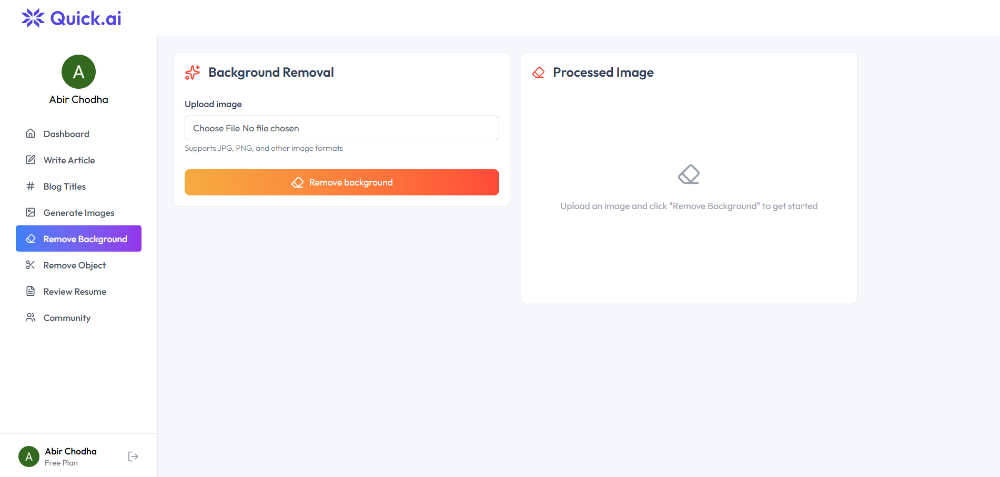
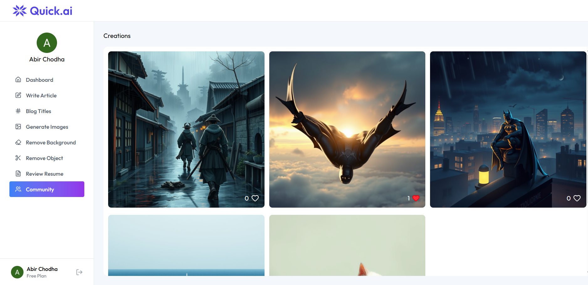

# QuickAI ✨

<div align="center">


**Transform your content creation with cutting-edge AI tools**

[](https://reactjs.org/)
[](https://nodejs.org/)
[](https://neon.tech/)
[](https://clerk.com/)

[Live Demo](https://quick-ai-client-beta.vercel.app/) · [Report Bug](https://github.com/abir2907/QuickAI/issues) · [Request Feature](https://github.com/abir2907/QuickAI/issues)

</div>

---

## 📸 Screenshots

<div align="center">

### 🏠 Home Page


_Clean and modern landing page with hero section_

### 🎨 Dashboard


_Track your creations and monitor usage_

### ✍️ AI Article Writer


_Generate high-quality articles with AI_

### 🖼️ Image Generation


_Create stunning visuals from text descriptions_

### 🎯 Background Removal


_Remove backgrounds with AI precision_

### 👥 Community Gallery


_Share and discover AI-generated creations_

</div>

---

## 📖 Overview

QuickAI is a comprehensive AI-powered SaaS platform that revolutionizes content creation through a suite of intelligent tools. From generating professional articles and catchy blog titles to creating stunning images and reviewing resumes, QuickAI empowers creators, marketers, and professionals to produce high-quality content effortlessly.

### ✨ Key Highlights

- 🤖 **6 AI-Powered Tools** - Article writing, image generation, background removal, and more
- 🔐 **Secure Authentication** - Clerk integration with OAuth support
- 💎 **Premium Plans** - Subscription management with tiered access
- 📱 **Responsive Design** - Seamless experience across all devices
- 🎨 **Modern UI/UX** - Built with Tailwind CSS and Lucide icons
- 🚀 **High Performance** - Optimized with Vite and efficient API calls

---

## 🎯 Features

### AI Tools Suite

| Tool                        | Description                                           | Access       |
| --------------------------- | ----------------------------------------------------- | ------------ |
| **📝 AI Article Writer**    | Generate high-quality, engaging articles on any topic | Free/Premium |
| **#️⃣ Blog Title Generator** | Create catchy, SEO-friendly blog titles instantly     | Free/Premium |
| **🖼️ AI Image Generation**  | Create stunning visuals from text descriptions        | Premium Only |
| **🎨 Background Removal**   | Remove image backgrounds with AI precision            | Premium Only |
| **✂️ Object Removal**       | Seamlessly remove unwanted objects from images        | Premium Only |
| **📄 Resume Reviewer**      | Get AI-powered feedback to improve your resume        | Premium Only |

### Platform Features

- **User Dashboard** - Track all your creations and monitor usage
- **Community Gallery** - Share and discover AI-generated images
- **Like System** - Engage with community creations
- **Usage Limits** - Free tier with 10 creations, unlimited for premium
- **Creation History** - Access all your past generations
- **Multiple Authentication** - Email, Google, GitHub, and more

---

## 🛠️ Tech Stack

### Frontend

- **Framework:** React 18 + Vite
- **Routing:** React Router v6
- **Styling:** Tailwind CSS v4
- **UI Components:** Lucide React Icons
- **Markdown:** React Markdown
- **Authentication:** Clerk React
- **HTTP Client:** Axios

### Backend

- **Runtime:** Node.js with Express 5
- **Database:** PostgreSQL (Neon Serverless)
- **Authentication:** Clerk Express
- **AI Services:**
  - OpenAI (Gemini 2.0 Flash)
  - ClipDrop API (Image Generation)
- **Image Processing:** Cloudinary
- **File Upload:** Multer
- **PDF Processing:** pdf-parse

### DevOps & Tools

- **Package Manager:** npm
- **Environment Management:** dotenv
- **Development:** Nodemon
- **CORS:** cors middleware

---

## 📁 Project Structure

```
QuickAI/
├── client/                    # Frontend React application
│   ├── src/
│   │   ├── assets/           # Images, icons, and static data
│   │   ├── components/       # Reusable UI components
│   │   │   ├── AiTools.jsx
│   │   │   ├── CreationItem.jsx
│   │   │   ├── Footer.jsx
│   │   │   ├── Hero.jsx
│   │   │   ├── Navbar.jsx
│   │   │   ├── Plan.jsx
│   │   │   ├── Sidebar.jsx
│   │   │   └── Testimonial.jsx
│   │   ├── pages/            # Application pages
│   │   │   ├── BlogTitles.jsx
│   │   │   ├── Community.jsx
│   │   │   ├── Dashboard.jsx
│   │   │   ├── GenerateImages.jsx
│   │   │   ├── Home.jsx
│   │   │   ├── Layout.jsx
│   │   │   ├── RemoveBackground.jsx
│   │   │   ├── RemoveObject.jsx
│   │   │   ├── ReviewResume.jsx
│   │   │   └── WriteArticle.jsx
│   │   ├── App.jsx           # Main app component
│   │   ├── main.jsx          # Application entry point
│   │   └── index.css         # Global styles
│   ├── index.html
│   └── vite.config.js
│
└── server/                    # Backend Node.js application
    ├── configs/              # Configuration files
    │   ├── cloudinary.js     # Cloudinary setup
    │   ├── db.js             # Database connection
    │   └── multer.js         # File upload configuration
    ├── controllers/          # Request handlers
    │   ├── aiController.js   # AI operations
    │   └── userController.js # User operations
    ├── middlewares/
    │   └── auth.js           # Authentication middleware
    ├── routes/
    │   ├── aiRoutes.js       # AI endpoints
    │   └── userRoutes.js     # User endpoints
    ├── package.json
    └── server.js             # Server entry point
```

---

## 🚀 Getting Started

### Prerequisites

Before you begin, ensure you have the following installed:

- Node.js (v18 or higher)
- npm or yarn
- Git

### Required API Keys

You'll need to obtain API keys from the following services:

1. **Clerk** - [clerk.com](https://clerk.com) (Authentication)
2. **Neon** - [neon.tech](https://neon.tech) (PostgreSQL Database)
3. **Google AI Studio** - [ai.google.dev](https://ai.google.dev) (Gemini API)
4. **ClipDrop** - [clipdrop.co](https://clipdrop.co) (Image Generation)
5. **Cloudinary** - [cloudinary.com](https://cloudinary.com) (Image Storage)

### Installation

1. **Clone the repository**

   ```bash
   git@github.com:abir2907/QuickAI.git
   cd QuickAI
   ```

2. **Install client dependencies**

   ```bash
   cd client
   npm install
   ```

3. **Install server dependencies**
   ```bash
   cd ../server
   npm install
   ```

### Environment Configuration

#### Client Environment Variables

Create a `.env` file in the `client` directory:

```env
VITE_CLERK_PUBLISHABLE_KEY=your_clerk_publishable_key
VITE_BASE_URL=http://localhost:3000
```

#### Server Environment Variables

Create a `.env` file in the `server` directory:

```env
# Server Configuration
PORT=3000

# Database
DATABASE_URL=your_neon_database_url

# Clerk Authentication
CLERK_PUBLISHABLE_KEY=your_clerk_publishable_key
CLERK_SECRET_KEY=your_clerk_secret_key

# AI Services
GEMINI_API_KEY=your_gemini_api_key
CLIPDROP_API_KEY=your_clipdrop_api_key

# Cloudinary
CLOUDINARY_CLOUD_NAME=your_cloudinary_cloud_name
CLOUDINARY_API_KEY=your_cloudinary_api_key
CLOUDINARY_API_SECRET=your_cloudinary_api_secret
```

### Database Setup

1. Create a Neon PostgreSQL database
2. Run the following SQL to create the required table:

```sql
CREATE TABLE creations (
  id SERIAL PRIMARY KEY,
  user_id VARCHAR(255) NOT NULL,
  prompt TEXT NOT NULL,
  content TEXT NOT NULL,
  type VARCHAR(50) NOT NULL,
  publish BOOLEAN DEFAULT false,
  likes TEXT[] DEFAULT '{}',
  created_at TIMESTAMP DEFAULT CURRENT_TIMESTAMP,
  updated_at TIMESTAMP DEFAULT CURRENT_TIMESTAMP
);
```

### Running the Application

1. **Start the backend server**

   ```bash
   cd server
   npm run server
   ```

   Server will run on `http://localhost:3000`

2. **Start the frontend development server**

   ```bash
   cd client
   npm run dev
   ```

   Client will run on `http://localhost:5173`

3. **Access the application**
   Open your browser and navigate to `http://localhost:5173`

---

## 💡 Usage Guide

### For Free Users

1. Sign up using email or social login
2. Access the dashboard
3. Use any AI tool up to 10 times
4. View your creation history

### For Premium Users

1. Upgrade to Premium plan
2. Unlimited access to all AI tools
3. Access exclusive features (Image Generation, Background Removal, etc.)
4. Share creations in the community gallery

### API Endpoints

#### AI Operations

- `POST /api/ai/generate-article` - Generate article
- `POST /api/ai/generate-blog-title` - Generate blog title
- `POST /api/ai/generate-image` - Generate image (Premium)
- `POST /api/ai/remove-image-background` - Remove background (Premium)
- `POST /api/ai/remove-image-object` - Remove object (Premium)
- `POST /api/ai/resume-review` - Review resume (Premium)

#### User Operations

- `GET /api/user/get-user-creations` - Get user's creations
- `GET /api/user/get-published-creations` - Get public creations
- `POST /api/user/toggle-like-creation` - Like/unlike creation

---

## 🌐 Deployment

### Frontend Deployment (Vercel/Netlify)

1. **Build the client**

   ```bash
   cd client
   npm run build
   ```

2. **Deploy to Vercel**

   ```bash
   npm i -g vercel
   vercel --prod
   ```

3. **Configure environment variables** in your hosting platform

### Backend Deployment (Render/Railway)

1. **Prepare for production**

   ```bash
   cd server
   npm start
   ```

2. **Deploy to Render**

   - Connect your GitHub repository
   - Set environment variables
   - Deploy from the `server` directory

3. **Update client `VITE_BASE_URL`** with your deployed backend URL

---

## 🤝 Contributing

Contributions are what make the open-source community such an amazing place to learn, inspire, and create. Any contributions you make are **greatly appreciated**.

1. Fork the Project
2. Create your Feature Branch (`git checkout -b feature/AmazingFeature`)
3. Commit your Changes (`git commit -m 'Add some AmazingFeature'`)
4. Push to the Branch (`git push origin feature/AmazingFeature`)
5. Open a Pull Request

---

## 👨‍💻 Author

**Abir**

- GitHub: [@abir2907](https://github.com/abir2907)
- LinkedIn: [Abir Chodha](https://www.linkedin.com/in/abir-chodha-46a983298/)
- Portfolio: [your-portfolio.com](https://your-portfolio.com)

---

## 🙏 Acknowledgments

- [Clerk](https://clerk.com) for authentication
- [Google AI](https://ai.google.dev) for Gemini API
- [ClipDrop](https://clipdrop.co) for image generation
- [Cloudinary](https://cloudinary.com) for image storage
- [Neon](https://neon.tech) for serverless PostgreSQL
- [Lucide](https://lucide.dev) for beautiful icons
- [Tailwind CSS](https://tailwindcss.com) for styling

---

## 📧 Support

If you have any questions or need help, please open an issue or contact me at abirchodha1@gmail.com

---

<div align="center">

**⭐ If you like this project, please give it a star! ⭐**

Made with ❤️ by Abir

</div>
